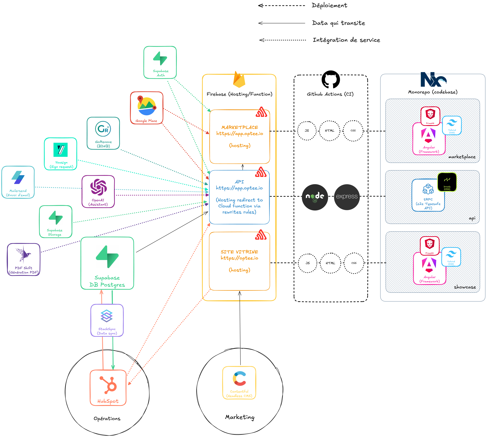

# Optee Applications 🅞

> This monorepo contains all applications, APIs, libraries, and scripts built by Optee. We use Nx to orchestrate these projects. Learn more in our [internal documentation](https://www.notion.so/Accueil-de-l-espace-d-quipe-25618599cccb807da5ccc0439fe29325).

## Get Started 🙌

> To run these projects locally, please follow the dedicated guide: [Get Started](https://www.notion.so/Get-Started-25318599cccb809e993fd2a711c49fda).

## Project Architecture 🏗️

Online version [here](https://excalidraw.com/#json=84MjrCUaAcWEZFzK32CQ9,Y0_V4ZH-cLJPbSVyISfmuw).
